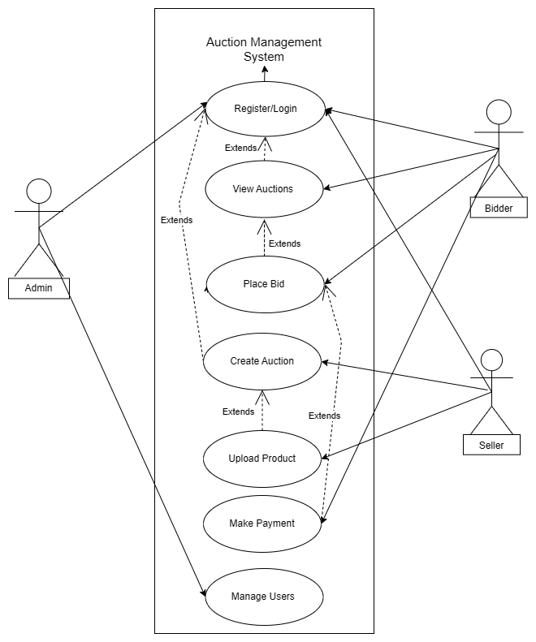
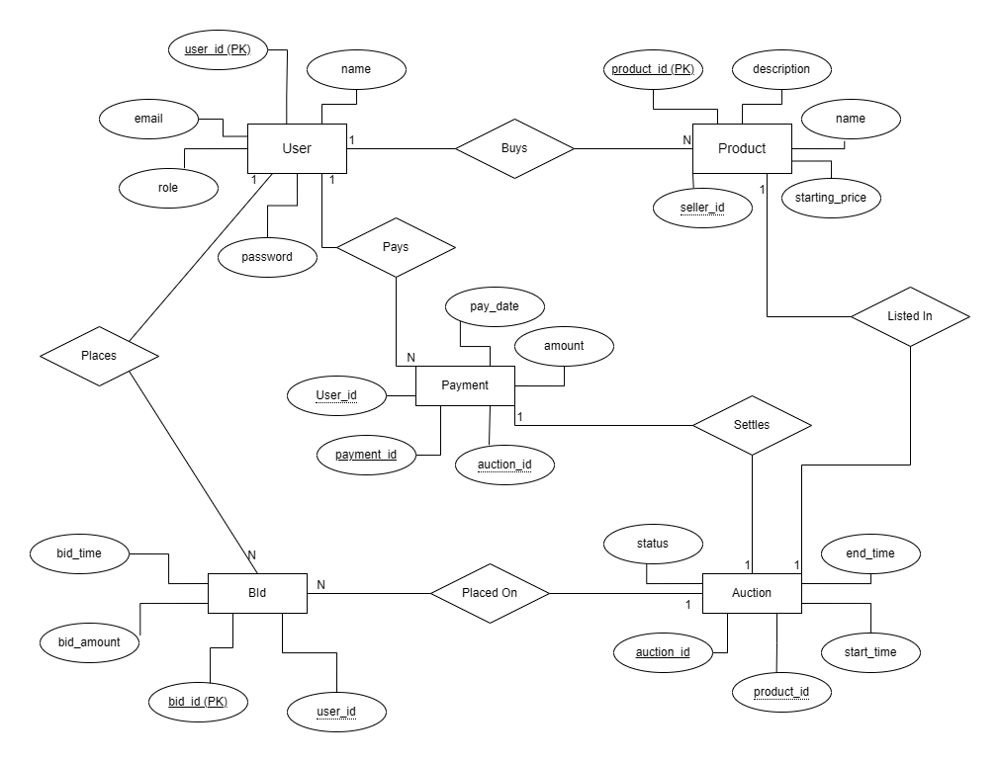
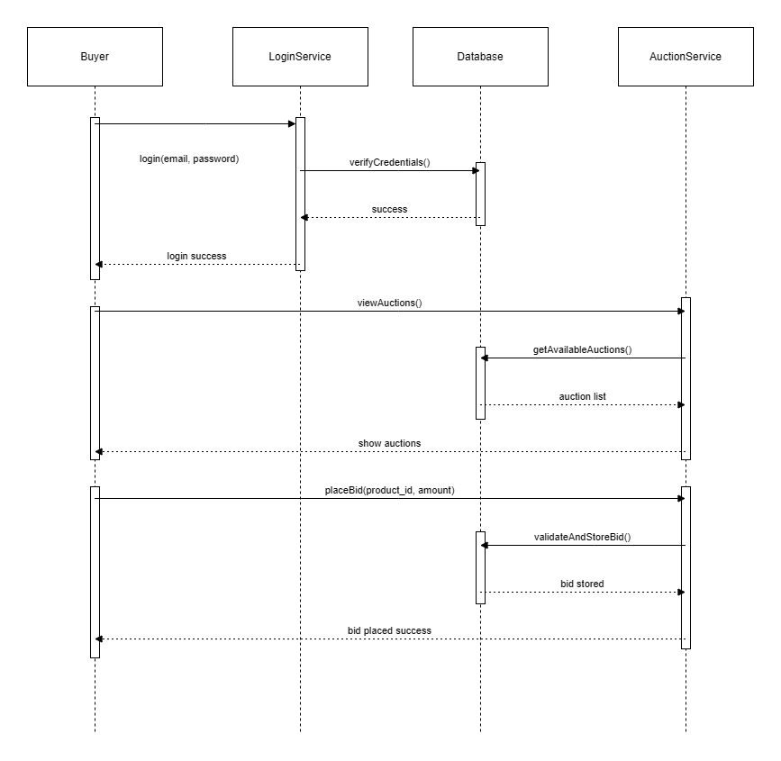
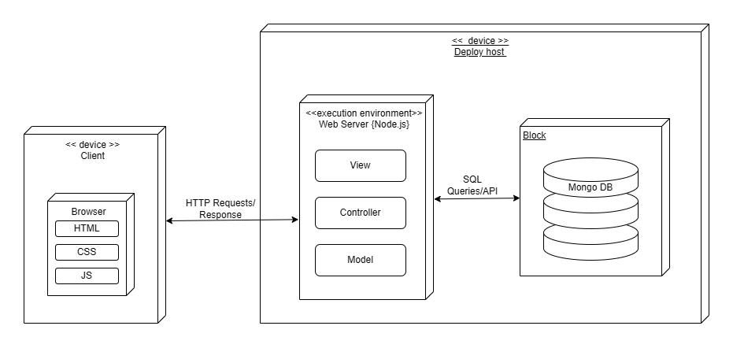
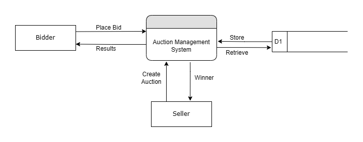
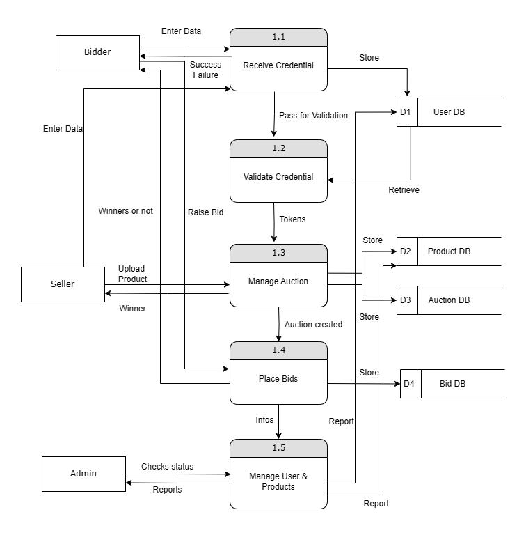
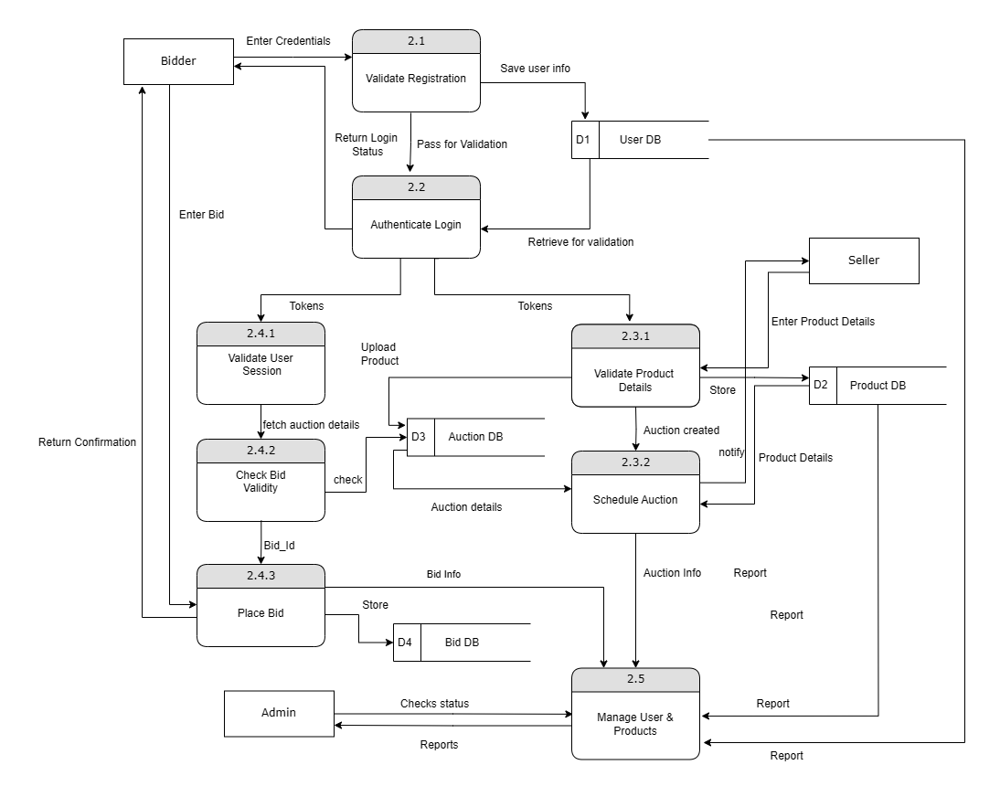
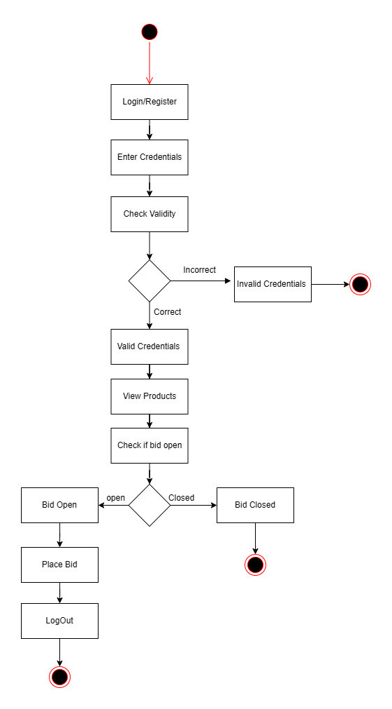
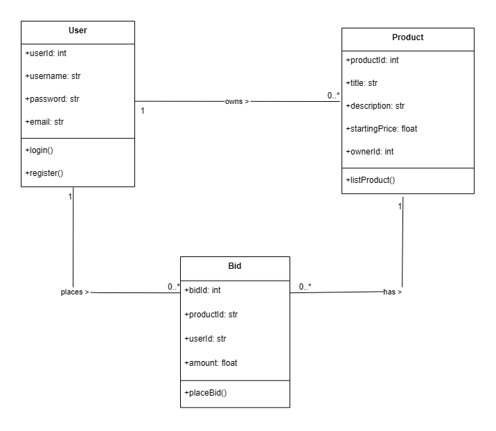

# Auction App UML & DFD Diagrams

## 🔹 Use Case Diagram

## 🔹 ER Diagram

## 🔹 Sequence Diagram

## 🔹 Deployment Diagram

## 🔹 DFD Level 0

## 🔹 DFD Level 1

## 🔹 DFD Level 2

## 🔹 Activity Diagram

## 🔹 Class Diagram

